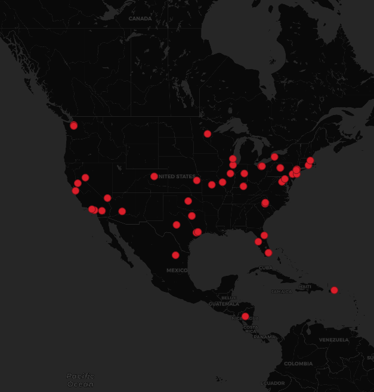

## geog458_lab2
## Thomas Kakatsakis

In this lab I utilized a Twitter crawler .ipynb file to download geo data about certain tweets. I set my crawler to observe Twitter output for 20 minutes, searching for the keyword 'Gamestop'. Everytime a tweet was submitted during this time period which contained both the word Gamestop as well as a geotagged location, information about that tweet was saved to a file.

The geotagged Twitter data is then displayed in a simple QGIS map. It shows a dark basemap of North America, with the locations of tweets in red. From this map, it can be shown that the viral Gamestop discussion is widespread throughout the United States, with a handful of tweets from neighboring countries in Latin America. Many of the tweets come from urban areas and cities within the US, with clusters in California and the Northeast. Despite this, a dispersed distribution shows that this event is not limited to a specific city or location.

The discussion being analyzed is based off of many amatuer stock traders buying up stock in Gamestop (GME) both to gain money, and also stand up to powerful hedgefunds which have shorted this stock and stand to lose billions of dollars. Of note is that while there are 83 tweets which were geotagged, there was several thousands during the 10 minute period which were not. The created map displays the geographic characteristcs of a few of the individuals who are captivated and tweeting about this event. This is a snapchat of a greater phenonmenon sweeping the world on January 29, 2021.
